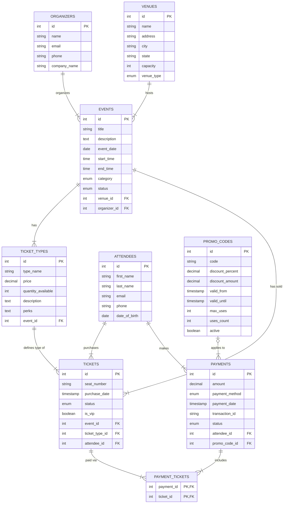

# Entity-Relationship Diagram

This document contains the Entity-Relationship (E-R) Diagram for the Concert Ticketing System.

## Legend

- **PK**: Primary Key
- **FK**: Foreign Key
- **||--|{**: One-to-Many relationship
- **|o--|{**: Optional One-to-Many relationship
- **||--||**: One-to-One relationship
